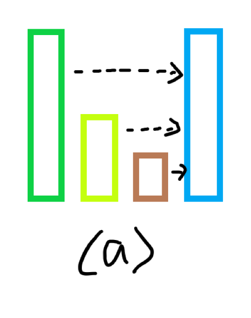
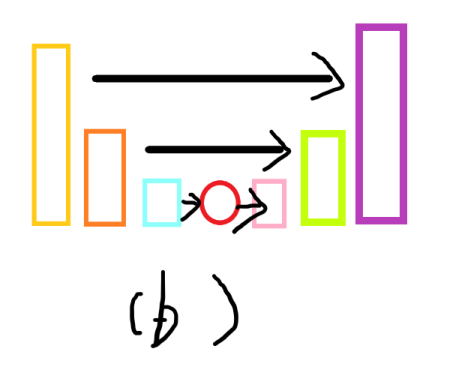

### 阶梯卷积 （Stairs）

#### 水下研究背景


#### 动机

众所周知，在网络的搭建过程中，加深网络可以捕获更丰富的特征信息，但也增强了网络的过拟合风险，过拟合现象对网络的泛化学习展现出极大的破坏。我们认为，表征像素的存在非一致的解析难度，过多或过少的参数量都会影响网络对某一表征像素的解析，且在成像环境复杂的水下场景中，同时存在着多种因素耦合作用的表征像素，为水下图像清晰化算法的泛化能力产生了巨大的阻碍。因此我们基于梯度下降法的自适应能力，设计了一种利用通道间关系的新型全局关注卷积，为中间阶段的输出提供多种参数量的计算路径。对比尺度放缩的策略，我们的方法能够有效降低所需计算资源，同时强化了特征间的关联，能带来更好的泛化效果。

#### 方法

对于某一给定输入的水下图像，我们可以简要将其存在的成像关系可以表示为:

$$
\begin{aligned} 
I(x,y) =& E^c(x,y) \cdot \exp[-a(c)\cdot d(x,y)] + \\
&B_{\infty}(c) \cdot (1-\exp[-a(c)\cdot d(x,y)]) + \\
&g^c(x,y) \bigotimes (E^c(x,y) \exp [-a(c)\cdot d(x,y)])
\end{aligned}
$$

其中$I(x,y)$为最终表征的像素，$E^c(x,y)$为水下物体的反射光(即未经衰减的真实场景)，$a(c)$ 为衰减系数，包含由吸收效应和散射效应造成的衰减,从其成像原理考虑，直接衰减分量$E^c(x,y) \cdot \exp[-a(c)\cdot d(x,y)]$只由水体对光线的衰减干扰，前向散射分量$g^c(x,y) \bigotimes (E^c(x,y) \exp [-a(c)\cdot d(x,y)])$则由存在与相机和成像物体间的散射微粒干扰，而后向散射$B_{\infty}(c) \cdot (1-\exp[-a(c)\cdot d(x,y)])$却可能被不存在与成像区域的微粒所干扰，简单而言，这三种不同的分量存在不一致的解析难度，有着不同的最适参数区间。



多数方法的做法是将所有分量视为一个整体，对所有表征像素采取一致的参数路径，以此对水下环境进行建模，这类做法固然取得了一定的优秀结果，但其最终的参数量并不一定是每个因素的最适区间，可能是部分降质因素折中的解析产物，这也解释了现有方法泛化性能受限于训练集、依旧存在部分错误增强的情况。为解决这一终极问题，我们设计了具有自适应分配通道参数的阶梯卷积，对提取到的表达不同降质因素的特征，分配不同参数量的解析路径，使不同特征的提取过程尽可能接近最适参数，以提升网络的性能。



阶梯卷积的设计如图a和b所示，台阶单元实际上是由（Conv+BN+Attention）组成，其输入的通道数则视为台阶的高度，可以看到，对于每个台阶而言，我们都可以将参数路径分为廉价的线性变化操作路径与更深入的卷积计算路径，通过多个台阶的堆叠，最终可以产生$2 \times n-1$个不同参数路径。假设输入图像存在直接衰减分量I、前向散射分量J与后向散射分量B，图b的计算过程其可以被表达为以下公式：

$$
\begin{aligned}
&I, F_{in}-I= CBA_{c}(F_{in}) \\
&B, F_{in}-I-B = CBA_{c//2}(F_{in}-I) \\
&J = CBA_{c//4}(F_{in}-I-B) \\
&F_{out} = Conv_{1\times 1}(Concat(L(I), L(B) ,J))

\end{aligned}
$$

其中，CBAU代表台阶单元，L为简单线性变换。当然，输入图像中还存在更为细分的降质因素，因此最终的计算过程可以表示为以下递归方程:

$$
\begin{aligned}
& I_{n+1}, L_n = CBAU(I_n) \\
& F_{out} = L_0 + L_{1={CBAU(I_1)}} + L_{2={CBAU^2(I_2)}} + ...
\end{aligned}
$$

许多研究者的模型表明，在实际场景中，仅使用卷积的特征提取过程达到最优水平的开销是巨大的，因此需要引入一些注意力机制以重点关注部分特征区域，对此，我们也设计了stairsblock-super以接入合适的注意力机制。与图b展示的一致，STB-super借鉴了解码-译码结构，采用了特征分离提取、特征一致融合策略，并在参数量最高的路径中额外执行必要的注意力计算，以充分利用各路径参数不一致的优势聚合难解析特征，并送入注意力机制中以加速学习过程。

#### 实现
阶梯卷积的实现无需额外的算子编程，适用于全部支持标准卷积算子的算力平台，具有易迁移的优点。

```python
class StairsBlockSimple(tf.keras.layers.Layer):
    def __init__(self, channels, kernel_size, padding='same', split_rate=2, trainable=True, name=None, dtype=None, dynamic=False, **kwargs):
        super(StairsBlockSimple, self).__init__(trainable, name, dtype, dynamic, **kwargs)
        c_ = max(channels, 8)
        self.channels_cv = Conv(filters=c_, kernel_size=1)
        self.split_rate = split_rate
        self.cv1 = Conv(filters=c_//self.split_rate, kernel_size=3)
        self.cv2 = Conv(filters=c_//(self.split_rate**2), kernel_size=3)
        self.shape_cv = Conv(filters=channels, kernel_size=kernel_size, padding=padding)

    def call(self, inputs, *args, **kwargs):
        x0 = self.channels_cv(inputs)
        split_tensor_1 = tf.split(x0, self.split_rate, axis=-1)
        
        x1 = self.cv1(tf.concat(split_tensor_1[:-1], axis=-1))
        split_tensor_2 = tf.split(x1, self.split_rate, axis=-1)

        x2 = self.cv2(tf.concat(split_tensor_2[:-1], axis=-1))
    
        out = self.shape_cv(tf.concat([x2,split_tensor_2[-1], split_tensor_1[-1]], axis=-1))
        return out
```
